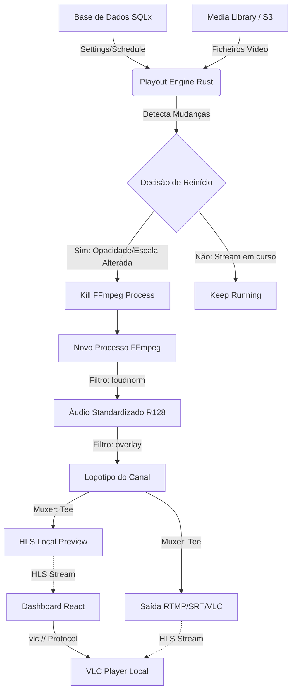

# Cloud Onepa Playout - Arquitetura do Sistema

## Pipeline de Vídeo (Phase 31)

O sistema utiliza um pipeline de processamento em tempo real baseado em FFmpeg, com normalização de áudio e sobreposição dinâmica.



### Componentes Principais

1.  **Backend (Rust/Actix)**: Gere a lógica de agendamento, o ciclo de vida dos processos FFmpeg e a API controladora.
2.  **Audio Normalization**: Implementação da norma EBU R128 (`loudnorm`) para garantir volume consistente entre clips de diferentes origens.
3.  **Real-time Overlay**: Monitorização de configurações de escala e opacidade para atualização instantânea (via restart seamless).
4.  **Frontend (React)**: Interface administrativa com monitor de LUFS e launcher inteligente para VLC.

```

```
