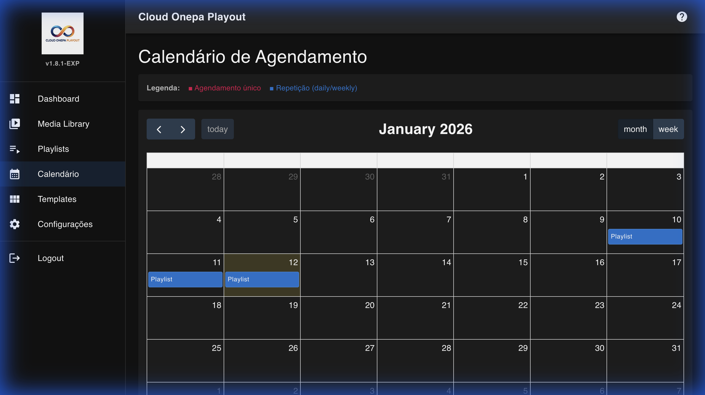

# Cloud Onepa Playout - Manual Visual do Utilizador

Este manual fornece um guia visual completo sobre as funcionalidades do sistema Cloud Onepa Playout PRO.

---

## 1. Dashboard (Painel de Controle)

\_O Dashboard fornece uma visão em tempo real do estado do playout, estatísticas de sistema e pré-visualização HLS.*
O Dashboard é a central de comando da operação. Aqui você monitoriza o stream, controla a reprodução e visualiza o estado do sistema.

### Funcionalidades Principais:

1.  **Monitor de Saída** (Topo):

    - Mostra o preview ao vivo do que está a ser transmitido.
    - **Botão "Open VLC"**:
      - **Smart Launcher**: Deteta se está em Windows, Mac ou Linux.
      - **Assistente**: Abre uma janela de diagnóstico que mostra o progresso do lançamento e fornece um comando manual se o navegador bloquear o link.
    - **Copy Link**: Copia o link HLS direto para usar em qualquer player externo.

2.  **Estado do Stream** (Direita):

    - **ON AIR / OFF AIR**: Indica se o motor de playout está ativo.
    - **CPU/RAM Temp**: Monitorização em tempo real do hardware do servidor.

3.  **Controlo de Reprodução** (Centro):

    - **Stop**: Pára o playout imediatamente (vai para "preto" ou cai o stream).
    - **Skip**: Pula o clipe atual para o próximo da lista.

4.  **Agendamento Atual** (Esquerda):
    - Mostra qual playlist ou evento está agendado para o momento atual.

---

## 2. Media (Gestão de Arquivos)

A biblioteca de mídia é onde você organiza seus vídeos, músicas e imagens.

\_Gestão centralizada de vídeos, áudio e imagens com suporte a categorias e fillers.*

- **Upload**: Arraste e solte arquivos ou use o botão de upload.
- **Categorias**: Filtre por Vídeo, Áudio ou Imagem.
- **Duração e Formato**: O sistema detecta automaticamente metadados (resolução, codec, duração).
- **Marcadores**: Defina pontos de entrada (In-point) e saída (Out-point) virtuais.

---

## 3. Playlists (Listas de Reprodução)

Crie sequências de reprodução para blocos comerciais, programas ou rodagem 24h.

\_Criação e edição de sequências de reprodução com arraste e solte.*

- **Criar Playlist**: Dê um nome e arraste itens da biblioteca de mídia.
- **Shuffle**: Misture a ordem dos itens aleatoriamente.
- **Loop**: Defina se a playlist deve repetir indefinidamente.

---

## 4. Calendar (Agendamento)

O calendário determina _o que_ passa e _quando_.

- **Eventos Únicos**: Arraste uma playlist para uma hora específica.
- **Eventos Recorrentes**:
  - **Diário**: Repete todos os dias à mesma hora.
  - **Semanal**: Repete em dias específicos da semana (ex: Segundas e Quartas).
- **Prioridade**: Eventos manuais têm prioridade sobre a grelha padrão.

---

## 5. Settings (Configurações)

Configure o comportamento técnico e visual do canal.

### Aba: Output (Saída)

\_Configurações completas de rede (SRT/RTMP), caminhos de sistema e qualidade de vídeo.*
Configure para onde o sinal é enviado.

- **Tipo de Output**:
  - **RTMP**: Para YouTube, Facebook, Twitch.
  - **SRT (NOVO)**: Protocolo de baixa latência e alta confiabilidade.
    - **Modo Caller**: O playout "liga" para um servidor remoto.
    - **Modo Listener**: O playout espera uma conexão (útil para links ponto-a-ponto com OBS/vMix).
  - **HLS**: Streaming HTTP local.

### Aba: Playout (Visual & Overlay)

Personalize a aparência do canal.

\_Controle preciso de opacidade (0-100%) e escala (0.1x a 2.0x) para o logótipo do canal.*

- **Identidade do Canal**: Nome que aparece nos relatórios.
- **Overlay (Marca d'água)**:
  - **Ativar/Desativar**: Liga ou desliga o logotipo sobre o vídeo.
  - **Opacidade (TEMPO REAL)**: Deslize para tornar o logo transparente (0% a 100%). As mudanças são instantâneas.
  - **Tamanho (TEMPO REAL)**: Ajuste o tamanho do logo (10% a 200%). As mudanças são instantâneas.
  - **Posição**: Escolha um dos 4 cantos.
  - **Upload de Logo**: Carregue um PNG (com transparência recomendada).

### Aba: Assets Protegidos

Gerencie arquivos críticos do sistema.

- **Logotipo da Aplicação**: Mude o logo que aparece no Login e na barra lateral.
- **Branding Animado**: Escolha entre logo estático ou vídeo de intro para a tela de login.

---

## 6. Ajuda & Suporte

Para problemas técnicos, verifique os logs no terminal do servidor ou contate o administrador do sistema.

**Versão do Sistema**: 1.9.1-PRO
**Build**: 2026-01-12
