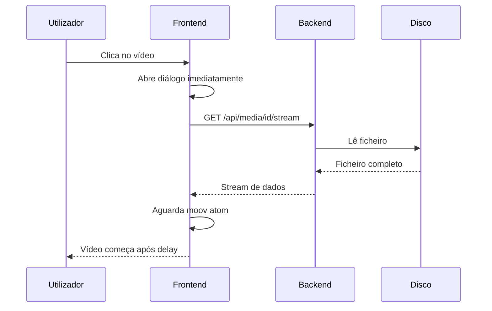

# Plano de Otimização: Carregamento de Vídeo na Media Library

## Problema Identificado

Quando o utilizador clica para visualizar um vídeo na Media Library, existe um atraso significativo antes de o vídeo começar a reproduzir. Isto acontece porque:

1. **Moov Atom no final do ficheiro** - A maioria dos ficheiros MP4 tem os metadados (moov atom) no final, obrigando o navegador a descarregar o ficheiro completo antes de iniciar a reprodução
2. **Sem indicador de loading** - O utilizador não vê feedback visual enquanto o vídeo carrega
3. **Sem preview image** - Não é mostrada uma imagem de preview enquanto o vídeo carrega
4. **Diálogo abre antes do conteúdo estar pronto** - O diálogo é exibido imediatamente, mas o vídeo ainda está a carregar

---

## Arquitetura Atual



---

## Plano de Otimização

### Fase 1: Feedback Visual Imediato

#### 1.1 Adicionar Loading Indicator no Diálogo
- **Ficheiro**: `frontend/src/pages/MediaLibrary.jsx`
- **Ação**: Adicionar estado de loading e spinner enquanto o vídeo carrega
- **Impacto**: O utilizador vê feedback imediato

#### 1.2 Mostrar Thumbnail como Poster
- **Ficheiro**: `frontend/src/pages/MediaLibrary.jsx`
- **Ação**: Usar a thumbnail existente como `poster` do elemento vídeo
- **Impacto**: Imagem visível instantaneamente

### Fase 2: Otimização de Carregamento

#### 2.1 Pré-carregar Metadados
- **Ficheiro**: `frontend/src/pages/MediaLibrary.jsx`
- **Ação**: Mudar `preload="metadata"` para `preload="auto"` ou usar carregamento progressivo
- **Impacto**: Início de reprodução mais rápido

#### 2.2 Implementar Endpoint de Range Otimizado
- **Ficheiro**: `backend/src/api/media.rs`
- **Ação**: Garantir que o endpoint serve apenas os bytes necessários para o moov atom
- **Impacto**: Carregamento inicial mais rápido

### Fase 3: Otimização de Ficheiros MP4

#### 3.1 Mover Moov Atom para o Início
- **Ficheiro**: `backend/src/services/ffmpeg.rs`
- **Ação**: Adicionar flag `-movflags +faststart` na transcodificação
- **Impacto**: Início de reprodução instantâneo para novos ficheiros

#### 3.2 Processar Ficheiros Existentes
- **Ação**: Criar script/método para processar ficheiros existentes
- **Impacto**: Todos os ficheiros beneficiam da otimização

---

## Detalhes de Implementação

### Tarefa 1: Loading Indicator + Poster

```jsx
// MediaLibrary.jsx - Preview Dialog
const [videoLoading, setVideoLoading] = useState(true);

<Dialog open={previewOpen} ...>
  <DialogContent>
    {selectedMedia?.media_type === 'video' && (
      <Box sx={{ position: 'relative' }}>
        {videoLoading && (
          <Box sx={{ 
            position: 'absolute', 
            top: '50%', 
            left: '50%', 
            transform: 'translate(-50%, -50%)' 
          }}>
            <CircularProgress />
          </Box>
        )}
        <video
          controls
          autoPlay
          poster={`/api/media/${selectedMedia.id}/thumbnail`}
          onLoadedData={() => setVideoLoading(false)}
          onCanPlay={() => setVideoLoading(false)}
          ...
        />
      </Box>
    )}
  </DialogContent>
</Dialog>
```

### Tarefa 2: Fast Start no FFmpeg

```rust
// ffmpeg.rs - Adicionar movflags faststart
args.extend(vec![
    "-movflags", "+faststart",  // Move moov atom para o início
    "-c:v", "libx264",
    ...
]);
```

### Tarefa 3: Endpoint de Metadados Rápido

```rust
// media.rs - Novo endpoint para obter range inicial
async fn get_video_metadata_range(media_id: Uuid) -> impl Responder {
    // Retorna apenas os primeiros bytes necessários
    // para o navegador encontrar o moov atom
}
```

---

## Estimativa de Impacto

| Otimização | Tempo Antes | Tempo Depois | Prioridade |
|------------|-------------|--------------|------------|
| Loading Indicator | 3-5s sem feedback | Feedback imediato | Alta |
| Poster Image | Tela preta | Imagem instantânea | Alta |
| Fast Start FFmpeg | 3-5s delay | <1s início | Alta |
| Range Otimizado | Download completo | Apenas necessário | Média |

---

## Ordem de Execução Recomendada

1. **Imediato**: Loading Indicator + Poster Image (frontend)
2. **Curto prazo**: Fast Start no FFmpeg (backend)
3. **Médio prazo**: Processar ficheiros existentes
4. **Longo prazo**: Otimizações avançadas de streaming

---

## Questões para Aprovação

1. Deseja implementar todas as fases ou apenas algumas específicas?
2. Devo processar automaticamente os ficheiros existentes ou apenas novos uploads?
3. Prefere uma implementação incremental ou completa de uma vez?

---

## Próximos Passos

Após aprovação, as tarefas serão implementadas na seguinte ordem:

- [ ] Adicionar loading indicator no preview dialog
- [ ] Adicionar poster image usando thumbnail existente
- [ ] Implementar fast start no FFmpeg para novos uploads
- [ ] Criar utilitário para processar ficheiros existentes
- [ ] Testar e validar melhorias
